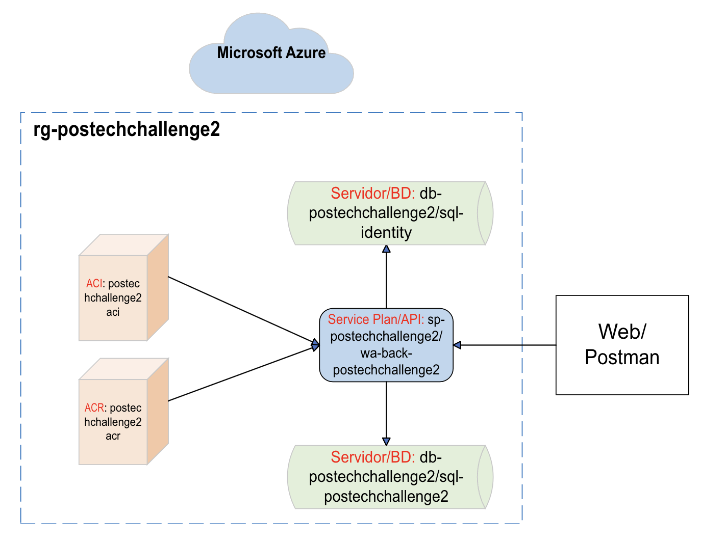
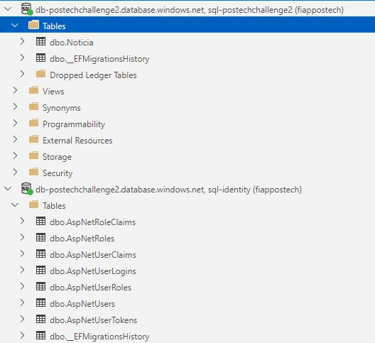

# PosNews - FIAP Pós Tech

#### Especialização em Arquitetura de Sistemas .NET com Azure: Fase II - Tech Challenge

# 0. Metadados

**Nome do Projeto:** PosNews

**Link da Aplicação:** https://wa-back-postechchallenge2.azurewebsites.net/swagger/index.html

**Desenvolvedores do Projeto:**

| Aluno                               | RM            |  
| --------------------------------    | ------------- | 
| André Marinho Valadão Batemarchi    | 348471        | 
| André Vinícius de Angelo Falcão     | 349140        | 
| Kaique Leonardo Gomes da Silva      | 349128        |
| Nathalia Lasagna Dias de souza      | 350089        |
| Rodrigo Castagnaro                  | 349122        |

**Tecnologias Utilizadas:**

| Tecnologia                               | Propósito                              |  
| -----------------------------------      | -------------------------------------- | 
| Portal Azure e Azure CLI                 | Infraestrutura                         | 
| .NET 6                                   | API                                    | 
| Microsoft SQL Server 12                  | Banco de Dados                         |
| Visual Studio 2022 e VS Code             | Desenvolvimento                        |
| Azure Data Studio                        | Apoio ao Banco de Dados                |
| GitHub                                   | Versionamento e Deploy Automático      |
| Miro                                     | Planejamento das demandas do trabalho  |
| Trello                                   | Kanban das demandas                    |
| Discord                                  | Comunicação da equipe                  |

# 1. Desafio

O Tech Challenge #2 consiste em desenvolver uma aplicação web com acesso a Banco de Dados (BD) para criação de um blog de notícias, conforme a entidade de BD sugerida.

**Requisitos:**

- A aplicação deve fazer uso de uma API contendo um endpoint de autenticação usando JWT ou Identity;

- A aplicação deve fazer uso de uma API contendo um endpoint REST, com autenticação, para gerenciamento de notícias: retornar todas as notícias ou retornar uma notícia pelo seu Id;

- Como ORM devemos utilizar o Entity Framework Core;

- Usar pipeline de CI/CD com o Azure DevOps ou com o GitHub Actions;

- Publicar os artefatos em uma VM ou container com ACR e ACI;
  
- A explicação da solução deve ser registrada em um vídeo e compartilhada no portal do aluno FIAP.

# 2. Nossa Solução

Primeiramente, definimos que usaríamos o Identity e, assim, 2 endpoints: um para cadastro de usuário e outro para login na aplicação.

Definimos que utilizaríamos o GitHub Actions para automatizar o processo de implantação.

Por fim, escolhemos a abordagem via container, usando ACR e ACI.

## 2.1. Arquitetura Proposta

Para concretizar as ideias do grupo, usamos os recursos do Azure, de acordo com a seguinte arquitetura:

**Figura 1:** Arquitetura do PosNews criada pelo grupo

De acordo com a Figura 1, a arquitetura do PosNews é descrita pelos itens a seguir:

1. A partir da infraestrutura do Microsoft Azure, agrupamos logicamente os recursos no Resource Group *rg-postechchallenge2*.

2. Criamos o Service Plan com Linux *sp-postechchallenge2* para abarcar a API do recurso de web app do back-end *wa-back-postechchallenge2*, que é executada em um container com Linux e recebe requisições via web/Postman.

3. A API realiza login do usuário ou cadastra um novo usuário no BD de usuários *sql-identity*. Caso a requisição for para um método que usa o BD de notícias *sql-postechchallenge2*, a API usa o Identity para autorizar ou não o usuário a gerenciar as notícias.

4. O ACI *postechchallenge2aci* executa a imagem *aspnetimage:v1* criada e disponibilizada no ACR *postechchallenge2acr*. [O Dockerfile para criação da imagem se encontra neste repositório](Dockerfile).

5. O resultado é verificado pelo usuário via Swagger ou Postman.

Por fim, apresentamos as entidades criadas, a partir do Migrations e Entity, para persistir as informações de notícias e de usuários. 

**Figura 2:** As entidades criadas pelo grupo

## 2.2. Explicação dos Recursos

Utilizamos os recursos no nível/tier mais básicos e a localidade Brazil South.

A seguir, definimos a função de cada recurso em nossa solução:

- Resource Group: **rg-postechchallenge2** - organiza logicamente todos os recursos.

- Azure Container Registry: **postechchallenge2acr** - ACR usado para subir a imagem criada para rodar a aplicação em um container Linux. A imagem criada se chama: **aspnetimage:v1**.

- Azure Container Instance: **postechchallenge2aci** - ACI usado para executar a imagem disponibilizada no ACR.

- App Service Plan: **sp-postechchallenge2** - nosso serviço para uso de recursos do tipo web app.

- Web App do back-end: **wa-back-postechchallenge2** - usado para comportar nossa API com .NET 6.

- Servidor SQL: **db-postechchallenge2** - nosso servidor de BD.

- BD SQL: **sql-postechchallenge2** - o BD em si, contendo a tabela *Noticia*.

- BD SQL: **sql-identity** - o BD em si, contendo as tabelas de usuários do Identity.

## 2.3. Código Desenvolvido

Para elucidar o código desenvolvido, fornecemos as informações a seguir, de cada pasta deste repositório.

Observação: na raiz deste repositório temos o Dockerfile e a Solution, contendo um projeto de API e um projeto class library para infraestrutura.

**Projeto PosNews (Api):**

- Contém os Controllers, Services, Repositories e Models/DTO.

- O Service possui os métodos relacionados ao Identity para gerenciamento de usuários da aplicação.

- O Repository possui os métodos para gerenciamento das notícias.

- Os endpoints fornecem as funcionalidades para criar uma notícia, obter todas as notícias e obter uma notícia específica.

- A API é documentada com o Swagger.

**Pasta Infraestrutura:**

- Contém as configurações de BD.
  
- Possui os migrations das entidades para os BDs no Azure.

**Pasta .github/workflows:**

- Contém o .yml utilizado para realizar deploy automático da aplicação na nuvem Azure com GitHub Actions.

**Pasta res:** recursos usados por este documento.

**Outras pastas:** armazenam informações de configurações das IDEs utilizadas.

## 2.4. Dockefile Criado

Criamos um Dockerfile, necessário para que nossa aplicação rode na nuvem Azure por meio de um container.

Utilizamos o Microsoft Artifact Registry (mcr.microsoft.com) para obter os recursos necessários (sdk e runtime) e rodar nossa aplicação em um ambiente Linux.

[Dockerfile criado](Dockerfile).

## 2.5. YAML Criado para Deploy Automático

Criamos um .yml para deploy automático via GitHub Actions. Neste caso, usamos o Ubuntu e as credenciais do Azure para publicação em container, [conforme arquivo do diretório .github/workflows](.github/workflows/main_wa-back-postechchallenge2.yml).

# 3. Azure - Comandos e Configurações Utilizados

Listamos aqui os comandos e configurações que usamos para publicar nossa solução no Azure. Observação: senhas/chaves/tokens foram censurados por questões de segurança.

- Resource group:

az group create --name rg-postechchallenge2 --location brazilsouth

- ACR:

az acr create --resource-group rg-postechchallenge2 --name postechchallenge2acr --sku Basic --admin-enabled true

- ACR (imagem):

az acr build --image aspnetimage:v1 --registry postechchallenge2acr --file Dockerfile .

- ACI:

az container create --resource-group rg-postechchallenge2 --name postechchallenge2aci --image postechchallenge2acr.azurecr.io/aspnetimage:v1 --dns-name-label postechchallenge2aci --ports 80

- Service Plan:

az appservice plan create --name sp-postechchallenge2 --resource-group rg-postechchallenge2 --sku F1 --location brazilsouth --is-linux

- Web App - back-end:

az webapp create --name wa-back-postechchallenge2 --resource-group rg-postechchallenge2 --plan sp-postechchallenge2 -i postechchallenge2acr.azurecr.io/aspnetimage:v1

- Servidor SQL:

az sql server create --name db-postechchallenge2 --location brazilsouth --resource-group rg-postechchallenge2 --admin-user fiappostech --admin-password senhaCensurada

- BD SQL de Notícias:

az sql db create --resource-group rg-postechchallenge2 --server db-postechchallenge2 --name sql-postechchallenge2 --service-objective S0 --zone-redundant false --backup-storage-redundancy Local

- BD SQL do Identity:

az sql db create --resource-group rg-postechchallenge2 --server db-postechchallenge2 --name sql-identity --service-objective S0 --zone-redundant false --backup-storage-redundancy Local

# 4. Observações

Apresentamos aqui os pontos de destaque para a apresentação de nossa solução:

1. Utilizamos o Entity Framework Core, conforme:

[Infraestrutura.csproj](/Infraestrutura/Infraestrutura.csproj)

[Contexts](/Infraestrutura/Contexts/)

[Repository](/PosNews/Repository/)

2. Documentamos com Swagger, mas demonstraremos via Postman.

3. Criamos o YAML [conforme arquivo do diretório .github/workflows](.github/workflows/main_wa-back-postechchallenge2.yml).

4. Faremos uma alteração simples via GitHub para demonstrar o Deploy Automático: [Classe Program](/PosNews/Program.cs).

# 5. Conclusões

Este repositório apresenta um projeto de API de notícias que usa o .NET com Entity e Identity, a tecnologia de containers, a nuvem Microsoft Azure e o GitHub Actions. Verificamos que é possível passar por todo o processo de CI/CD de uma aplicação completa que utiliza containers na nuvem Azure. Com o auxílio do GitHub, pudemos realizar deploy automático em containers e verificar de forma quase que instantânea as atualizações feitas na aplicação. Graças à nuvem da Microsoft pudemos colocar em prática a arquitetura proposta e superar o desafio do tech challenge 2.

# 6. Referências

1. [Architecting Modern Web Applications with ASP.NET Core and Microsoft Azure](https://dotnet.microsoft.com/en-us/download/e-book/aspnet/pdf)

2. [Azure Command-Line Interface (CLI) documentation](https://learn.microsoft.com/en-us/cli/azure/)

3. [Azure Container Registry](https://azure.microsoft.com/en-us/products/container-registry)

4. [Container Instances](https://azure.microsoft.com/en-us/products/container-instances)

5. [Tutorial: Create a web API with ASP.NET Core](https://learn.microsoft.com/en-us/aspnet/core/tutorials/first-web-api?view=aspnetcore-6.0&tabs=visual-studio)

6. [What is GitHub Actions for Azure](https://learn.microsoft.com/en-us/azure/developer/github/github-actions)

